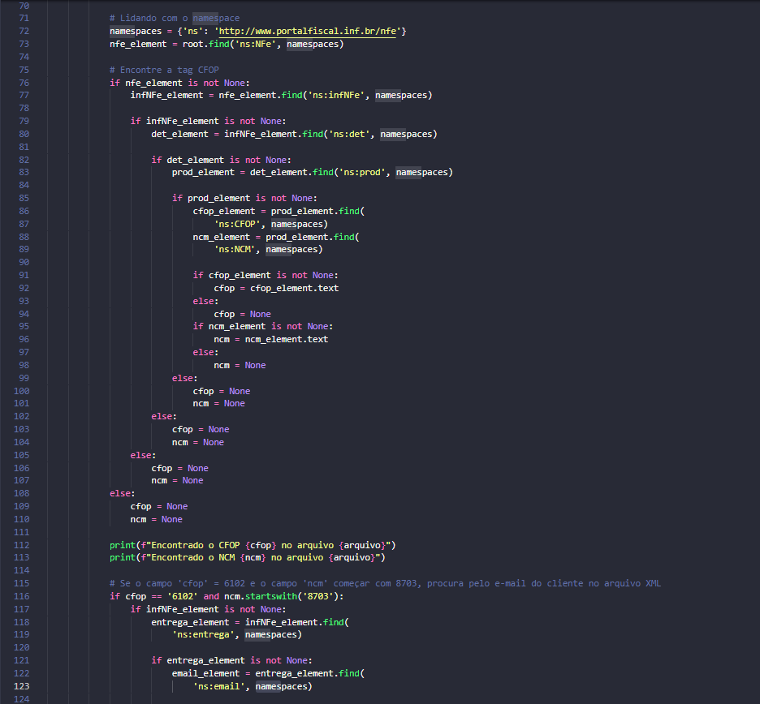

# Esse trecho de código navega pelas tags do XML para buscar o código CFOP e NCM

 ## * Explicação detalhada:

 ### Este bloco de código realiza as seguintes ações:

1. **Define um "namespace" para o XML**: Na XML, um namespace é um conjunto de nomes de elementos e atributos que são únicos e distinguíveis. Isso é feito para evitar conflitos de nomes quando diferentes partes de um documento XML vêm de diferentes fontes. Nesse caso, o namespace usado é "http://www.portalfiscal.inf.br/nfe", que é mapeado para a string 'ns'.

2. **Procura o elemento 'NFe' no arquivo XML**: O código tenta encontrar o elemento 'NFe' dentro do arquivo XML.

3. **Procura o elemento 'infNFe' se 'NFe' for encontrado**: Se o elemento 'NFe' for encontrado, o código tentará encontrar o elemento 'infNFe' dentro de 'NFe'.

4. **Procura o elemento 'det' se 'infNFe' for encontrado**: Se 'infNFe' for encontrado, ele procura por 'det' dentro de 'infNFe'.

5. **Procura o elemento 'prod' se 'det' for encontrado**: Se 'det' for encontrado, ele procura por 'prod' dentro de 'det'.

6. **Procura o elemento 'CFOP' se 'prod' for encontrado**: Se 'prod' for encontrado, ele procura por 'CFOP' dentro de 'prod'. Se 'CFOP' for encontrado, o código captura o texto dentro desse elemento e o armazena na variável 'cfop'.

7. **Atribui None a 'cfop' se qualquer elemento não for encontrado**: Se em qualquer ponto ao longo do caminho um dos elementos não for encontrado, o código define 'cfop' como None e segue para a próxima iteração.

8. **Verifica o valor de 'cfop'**: Uma vez que o valor de 'cfop' é obtido, ele é verificado se é igual a '6102'. Se for, o código procura pelo elemento 'entrega' dentro de 'infNFe'.

9. **Procura o elemento 'email' se 'entrega' for encontrado**: Se 'entrega' for encontrado, o código procura pelo elemento 'email' dentro de 'entrega'. Se 'email' for encontrado, ele captura o texto dentro desse elemento.

